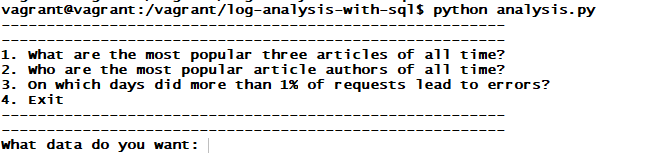

# logs-analysis
Analyzing the postgresql database

## **Udacity FSND - Logs Analysis Project**

### The summary of the assignment:  
to create a reporting tool that prints out reports (in plain text) based on the data 
in [the given database](https://d17h27t6h515a5.cloudfront.net/topher/2016/August/57b5f748_newsdata/newsdata.zip).  
  
This project sets up a mock PostgreSQL database for a fictional news website. The provided Python script uses the psycopg2 library to query the database and produce a report.  

**So what are we reporting, anyway?**  
Here are the questions the reporting tool should answer. The example answers given aren't the right ones, though!  

**1. What are the most popular three articles of all time? Which articles have been accessed the most?
Present this information as a sorted list with the most popular article at the top.**  
  
Example:  
  
"Princess Shellfish Marries Prince Handsome" — 1201 views  
"Baltimore Ravens Defeat Rhode Island Shoggoths" — 915 views  
"Political Scandal Ends In Political Scandal" — 553 views  

**2. Who are the most popular article authors of all time?
That is, when you sum up all of the articles each author has written, which authors get the most page views?
Present this as a sorted list with the most popular author at the top.**  
  
Example:  
  
Ursula La Multa — 2304 views  
Rudolf von Treppenwitz — 1985 views  
Markoff Chaney — 1723 views  
Anonymous Contributor — 1023 views  

**3. On which days did more than 1% of requests lead to errors?
The log table includes a column status that indicates the HTTP status code that the news site sent to the user's browser.
(Refer to this lesson for more information about the idea of HTTP status codes.)**  
  
Example:  
  
July 29, 2016 — 2.5% errors  

### Example outputs:  

**First screen:**  
  

  
**If the first option is chosen:**  
  
  
  
### How to use:
  
  - Start you virtual machine and login  
    -- Using [the same environment](https://github.com/udacity/fullstack-nanodegree-vm/blob/master/vagrant/Vagrantfile) is recommended.  
    -- vagrant up & vagrant ssh
  - Download [the database file](https://d17h27t6h515a5.cloudfront.net/topher/2016/August/57b5f748_newsdata/newsdata.zip)
   and place it in the same folder  
    -- Unzip newsdata.zip first in order to extract newsdata.sql
   - Import the file into the news database using the following psql command:  
    -- psql -d news -f newsdata.sql
   - Add the necessary views, which are shared below, to the database 
   - Run the file analysis.py  
    -- $ python analysis.py
   - Now, it is ready!

### The views added to the database:  

  - ```sql
    CREATE VIEW view_articles AS  
    SELECT path, count(*) AS views  
    FROM log  
    WHERE path LIKE '/article/%' AND status = '200 OK'  
    GROUP BY path ORDER BY views DESC;    
    ```
    
   - ```sql
     CREATE VIEW err_percentages AS  
     SELECT time::date,  
            100.0 * sum(case when status != '200 OK' then 1 else 0 end) / count(*) AS err_pct  
     FROM log  
     GROUP BY time::date  
     ORDER BY time::date;  
    ```
    
